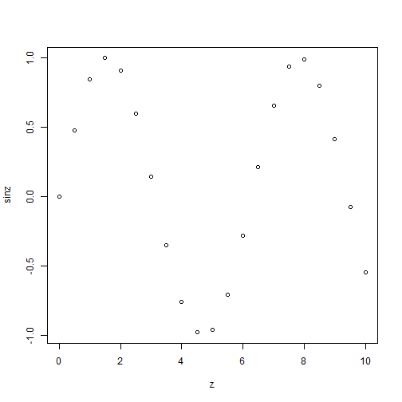
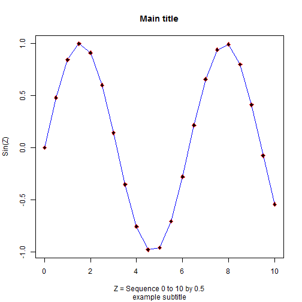

# Day1 Session 1
Melinda Higgins  
March 10, 2016  
---

## Introduction to Git and Github

For this first part, go to my slide set overview at [http://melindahiggins2000.github.io/web2/teaching/CDCslidesMar2016/#1](http://melindahiggins2000.github.io/web2/teaching/CDCslidesMar2016/#1).

These slides cover the information on:
* GIT [https://git-scm.com/](https://git-scm.com/)
* Github [https://github.com/](https://github.com/)
* Github Desktop Client [https://desktop.github.com/](https://desktop.github.com/)

---

## Files, Code and Data for this workshop

You can download all of the data, code and files for this workshop at my Github repository at [https://github.com/melindahiggins2000/CDCRworkshopCode](https://github.com/melindahiggins2000/CDCRworkshopCode). From here click on "Download ZIP" to download everything to your local computer/storage location. You could also "fork" my repository and then "clone" it to your local computer.

I also built a Github repository for this Gitbook "CDC R Workshop". Here are the relevant links:
* my Github repository for the book [https://github.com/melindahiggins2000/CDCRworkshop](https://github.com/melindahiggins2000/CDCRworkshop)
* the final Gitbook [https://www.gitbook.com/book/melindahiggins2000/cdcrworkshop/details](https://www.gitbook.com/book/melindahiggins2000/cdcrworkshop/details)
* and if you'd like to create your own Gitbook [https://www.gitbook.com/](https://www.gitbook.com/)

---

## Explore RStudio
1. Open/Run RStudio
2. Explore the windows and menus
3. See what your settings are in "Tools"/"Global Options"
   + change your "Appearance" to a font size and theme you like
   + take a look at the other options but leave the defaults for now
4. Create a New File - go to "File"/"New File"/"R Script"
    + This will create a new (blank) window at the top left where you can type in an execute R commands. This is similar to the SAS program window.
    + As you type in commands you can select the command (or commands) you want to execute and click "Run" or go to the end of the line and hit "Cntl-Enter".
    + You can also execute commands in the Console window (lower left) but this is like typing commands in at the command line and harder to enter longer commands and edit as needed.
    + However as you run commands from the R Script window, they are echo'd in the Console window. And output is also shown in the console window as appropriate.
    
## Begin writing code in your new script window.

Now that you have your R Script window open, go ahead and save it somewhere on your computer/local storage location (e.g. flash drive, cloud or network drive). Click "File"/"Save As"/ and enter in a name for your file "myfile.r". If you leave off the ".r" extension, it should be added automatically for you. Open your local drive and check to make sure the file saved correctly.

As you enter code, it is always a good idea to add informative comments as you go. The number sign `#` is the delimiter R uses to denote comments. Anything typed after the `#` is echo'd to the screen and not executed. You'll also notice that the R scripting window inside RStudio trys to be helpful by color coding different commands, functions, variables and such so you notice each is handled differently. The comments will be a different color than commands R is trying to execute as code.

Let's try the following code `getwd()` to see what R thinks is your current "home" directory.

```
# ======================================
# see what directory R is currently set to
getwd()

# ======================================
# change your "working directory"
# to a location of your choice
setwd('C:/MyGithub/CDCRworkshopCode')

# ======================================
# check location again
getwd()
```
## aaaaaaaaaaaa


```r
> # ======================================
> 
> # ========================================
> # type in commands to do some math
> # ========================================
> 2 + 2
```

```
[1] 4
```

```r
> 3 + (4*8)
```

```
[1] 35
```

```r
> 3 + 4*8
```

```
[1] 35
```

```r
> 6 + (8**2) # exponents can be done using two
```

```
[1] 70
```

```r
>            # asterix's ** or you can use
>            # the caret ^ symbol
> 12^2
```

```
[1] 144
```

```r
> pi         # pi is a built in Constant
```

```
[1] 3.141593
```

```r
> 4 * pi
```

```
[1] 12.56637
```

```r
> # ====================================
> # pi is a Constant built into R
> # what are the others?
> # ====================================
> help(Constants)
> 
> LETTERS
```

```
 [1] "A" "B" "C" "D" "E" "F" "G" "H" "I" "J" "K" "L" "M" "N" "O" "P" "Q"
[18] "R" "S" "T" "U" "V" "W" "X" "Y" "Z"
```

```r
> letters
```

```
 [1] "a" "b" "c" "d" "e" "f" "g" "h" "i" "j" "k" "l" "m" "n" "o" "p" "q"
[18] "r" "s" "t" "u" "v" "w" "x" "y" "z"
```

```r
> month.abb
```

```
 [1] "Jan" "Feb" "Mar" "Apr" "May" "Jun" "Jul" "Aug" "Sep" "Oct" "Nov"
[12] "Dec"
```

```r
> month.name
```

```
 [1] "January"   "February"  "March"     "April"     "May"      
 [6] "June"      "July"      "August"    "September" "October"  
[11] "November"  "December" 
```

```r
> # ====================================
> # Let's create some data objects
> # and variables with R 
> # ====================================
> # create x which had 1 numeric value
> x <- 3 * 5    # notice nothing is shown in the console
>               # you have to type the name of the object 
>               # to "see" it
> x
```

```
[1] 15
```

```r
> # create y which is a numeric (integer) vector
> # with 12 elements
> y <- 1:12
> y
```

```
 [1]  1  2  3  4  5  6  7  8  9 10 11 12
```

```r
> # create z a numeric vector
> # containing a sequence of numbers from
> # 0 to 10 in units of 0.5
> z <- seq(0,10,.5)
> 
> # the above code can also be done with the
> # explict function arguments defined
> # see the examples in help(seq)
> help(seq)
> z <- seq(from=0, to=10, by=0.5)
```

```
# click on Edit/Data Editor
# choose z
# can also invoke data editor with
# fix() function
fix(z)
```


```r
> # create new object sinz which is a numeric
> # vector now containing the sin (sine function) 
> # of the z values
> sinz <- sin(z)
> 
> # let's look at the objects created so far
> ls()
```

```
 [1] "a1"         "a1to5cbind" "a1to5df"    "a1to5dfnf"  "a1to5list" 
 [6] "a1to5rbind" "a2"         "a3"         "a4"         "a5"        
[11] "alist1"     "bib"        "df1"        "df2"        "sinz"      
[16] "x"          "y"          "z"         
```

```r
> # ========================================
> # while you can see information about each of these
> # objects in the Global Environment (top right)
> # of the RStudio window, the function length()
> # is useful for determining how many elements are
> # in a given vector/data object.
> # ========================================
> length(x)
```

```
[1] 1
```

```r
> length(y)
```

```
[1] 12
```

```r
> length(z)
```

```
[1] 21
```

```r
> length(sinz)
```

```
[1] 21
```

```r
> # ========================================
> # other functions that are helpful for finding
> # out about data objects is the str() "structure"
> # function and the class() function.
> # ========================================
> str(y)
```

```
 int [1:12] 1 2 3 4 5 6 7 8 9 10 ...
```

```r
> class(y)
```

```
[1] "integer"
```

```r
> str(z)
```

```
 num [1:21] 0 0.5 1 1.5 2 2.5 3 3.5 4 4.5 ...
```

```r
> class(z)
```

```
[1] "numeric"
```

```r
> # ========================================
> # so, what happens when we mix different kinds
> # of data inside a vector.
> # these first 3 vectors each have elements that 
> # are all the same type.
> # a1 is numeric
> # a2 is character
> # a3 is logical
> # a4 is mixed numeric, character and logical
> #    so R sets all to the best option
> #    so a4 becomes all character type
> # a5 is also mixed but only numeric and logical
> #    In this case, the logical values are converted
> #    to numeric and TRUE becomes 1 and FALSE becomes 0
> # ========================================
> a1 <- c(1,2,3,4,10,11)
> a2 <- c('a','g','f','r','t','s')
> a3 <- c(TRUE,FALSE,TRUE,TRUE,FALSE,TRUE)
> a4 <- c(1,2,'a','b',TRUE,FALSE)
> a5 <- c(1,2,3,4,TRUE,FALSE)
> 
> # use the class() function to investigate these further
> class(a1)
```

```
[1] "numeric"
```

```r
> class(a2)
```

```
[1] "character"
```

```r
> class(a3)
```

```
[1] "logical"
```

```r
> class(a4)
```

```
[1] "character"
```

```r
> class(a5)
```

```
[1] "numeric"
```

```r
> # you can combine these vectors in a couple of ways
> # using cbind()
> a1to5cbind <- cbind(a1,a2,a3,a4,a5)
> class(a1to5cbind)
```

```
[1] "matrix"
```

```r
> str(a1to5cbind)
```

```
 chr [1:6, 1:5] "1" "2" "3" "4" "10" "11" "a" "g" ...
 - attr(*, "dimnames")=List of 2
  ..$ : NULL
  ..$ : chr [1:5] "a1" "a2" "a3" "a4" ...
```

```r
> dim(a1to5cbind)
```

```
[1] 6 5
```

```r
> #using rbind()
> a1to5rbind <- rbind(a1,a2,a3,a4,a5)
> class(a1to5rbind)
```

```
[1] "matrix"
```

```r
> str(a1to5rbind)
```

```
 chr [1:5, 1:6] "1" "a" "TRUE" "1" "1" "2" "g" "FALSE" ...
 - attr(*, "dimnames")=List of 2
  ..$ : chr [1:5] "a1" "a2" "a3" "a4" ...
  ..$ : NULL
```

```r
> dim(a1to5rbind)
```

```
[1] 5 6
```

```r
> #using list()
> a1to5list <- list(a1,a2,a3,a4,a5)
> class(a1to5list)
```

```
[1] "list"
```

```r
> str(a1to5list)
```

```
List of 5
 $ : num [1:6] 1 2 3 4 10 11
 $ : chr [1:6] "a" "g" "f" "r" ...
 $ : logi [1:6] TRUE FALSE TRUE TRUE FALSE TRUE
 $ : chr [1:6] "1" "2" "a" "b" ...
 $ : num [1:6] 1 2 3 4 1 0
```

```r
> dim(a1to5list)
```

```
NULL
```

```r
> #using data.frame()
> a1to5df <- data.frame(a1,a2,a3,a4,a5)
> class(a1to5df)
```

```
[1] "data.frame"
```

```r
> str(a1to5df)
```

```
'data.frame':	6 obs. of  5 variables:
 $ a1: num  1 2 3 4 10 11
 $ a2: Factor w/ 6 levels "a","f","g","r",..: 1 3 2 4 6 5
 $ a3: logi  TRUE FALSE TRUE TRUE FALSE TRUE
 $ a4: Factor w/ 6 levels "1","2","a","b",..: 1 2 3 4 6 5
 $ a5: num  1 2 3 4 1 0
```

```r
> dim(a1to5df)
```

```
[1] 6 5
```

```r
> # ========================================
> # so we've learned about small data objects
> # but ultimately we'll be working with a 
> # large dataset with numerous variables of
> # different types. In R these datasets are
> # called data frames. We can create one
> # using the data.frame() function. Let's
> # combine y which contains numbers from 1 to 12
> # with the abbreviations and names of the months.
> # ========================================
> df1 <- data.frame(y, month.name, month.abb)
```

```
# also try View function
# note that CaSe matters
view(df1)
View(df1)
```


```r
> # since this is a small dataset we can
> # look at in the console - just type the
> # object name.
> df1
```

```
    y month.name month.abb
1   1    January       Jan
2   2   February       Feb
3   3      March       Mar
4   4      April       Apr
5   5        May       May
6   6       June       Jun
7   7       July       Jul
8   8     August       Aug
9   9  September       Sep
10 10    October       Oct
11 11   November       Nov
12 12   December       Dec
```

```r
> # we can also view subsets of the data
> # two easy ways to view are head()
> # and tail() which lists either the 1st
> # 6 rows or the last 6 rows in the 
> # data frame.
> head(df1)
```

```
  y month.name month.abb
1 1    January       Jan
2 2   February       Feb
3 3      March       Mar
4 4      April       Apr
5 5        May       May
6 6       June       Jun
```

```r
> tail(df1)
```

```
    y month.name month.abb
7   7       July       Jul
8   8     August       Aug
9   9  September       Sep
10 10    October       Oct
11 11   November       Nov
12 12   December       Dec
```

```r
> # make a simple plot
> plot(z,sinz)
```



```r
> # redo plot with axis labels, a title and a subtitle
> plot(z, sinz, 
+      xlab='Z = Sequence 0 to 10 by 0.5', 
+      ylab='Sin(Z)', 
+      main='Main title', 
+      sub='example subtitle')
> 
> # add a BLUE line using lines()
> lines(z,sinz,col='blue')
> 
> # customize the points using points()
> # plotting character pch 23 is a filled diamond
> # col defines the color
> # bg defines the filled or background color
> points(z,sinz,pch=23,col='red',bg='black')
```



```r
> # select code above, right click and "run selection"
> # or highlight code and click CTRL-R
> # specifically run the following code all together
> # the spaces and line returns added for clarity
> # Note: RStudio helps with good formatting practices
> 
> plot(z, sinz,
+      xlab = 'Z = Sequence 0 to 10 by 0.5',
+      ylab = 'Sin(Z)',main='Main title',
+      sub = 'example subtitle')
> lines(z, sinz, col = 'blue')
> points(z, sinz, pch = 23, col = 'red', bg = 'black')
```


```r
> # In graphics Window, right click and either
> # copy as either metafile or bitmap.
> # or Save as metafile or postscript
> # Metafile is the Windows Vector graphics format
> # which is scalable and portable. The bitmap format
> # will not scale as well. Many journals prefer postscript.
> 
> # ========================================
> # Installing a package
> # let's try adding in some additional
> # functionality into R. We'll install
> # the ggplot2 package using the 
> # install.packages() function and then load
> # the ggplot2 package using the library()
> # function.
> # ========================================
> 
> install.packages("ggplot2")
```

```
Installing package into 'C:/Users/MKHIGGI/Documents/R/win-library/3.2'
(as 'lib' is unspecified)
```

```
Warning: package 'ggplot2' is in use and will not be installed
```

```r
> library(ggplot2)
> help(package="ggplot2")
> 
> # ========================================
> # However, now that we've added ggplot2
> # we can now use the qplot() function
> # to do a "quick plot."
> # ========================================
> 
> qplot(z, sinz,
+       geom = c("point", "line"),
+       xlab = 'Z = Sequence 0 to 10 by 0.5',
+       ylab = 'Sin(Z)',
+       main = 'Main title')
```


```r
> # ========================================
> # When you use add-on packages it
> # is always a good idea to make sure you
> # list which version of R you are using
> # and which version of each package you are
> # using. The sessionInfo() command shown below
> # will give you this info. It is also a good
> # idea to use the current citation as follows:
> 
> citation(package = "base") # to cite current R
```

```

To cite R in publications use:

  R Core Team (2015). R: A language and environment for
  statistical computing. R Foundation for Statistical Computing,
  Vienna, Austria. URL https://www.R-project.org/.

A BibTeX entry for LaTeX users is

  @Manual{,
    title = {R: A Language and Environment for Statistical Computing},
    author = {{R Core Team}},
    organization = {R Foundation for Statistical Computing},
    address = {Vienna, Austria},
    year = {2015},
    url = {https://www.R-project.org/},
  }

We have invested a lot of time and effort in creating R, please
cite it when using it for data analysis. See also
'citation("pkgname")' for citing R packages.
```

```r
> citation(package = "ggplot2") # to cite current package
```

```

To cite ggplot2 in publications, please use:

  H. Wickham. ggplot2: Elegant Graphics for Data Analysis.
  Springer-Verlag New York, 2009.

A BibTeX entry for LaTeX users is

  @Book{,
    author = {Hadley Wickham},
    title = {ggplot2: Elegant Graphics for Data Analysis},
    publisher = {Springer-Verlag New York},
    year = {2009},
    isbn = {978-0-387-98140-6},
    url = {http://ggplot2.org},
  }
```

```r
> # ========================================
> # It is a good idea when collaborating
> # and sharing your code with others to take
> # a snapshot of your computer system and your
> # specific R environment and session settings.
> # you can do this using the sessionInfo()
> # function. Here is mine.
> # ========================================
> sessionInfo()
```

```
R version 3.2.3 (2015-12-10)
Platform: x86_64-w64-mingw32/x64 (64-bit)
Running under: Windows >= 8 x64 (build 9200)

locale:
[1] LC_COLLATE=English_United States.1252 
[2] LC_CTYPE=English_United States.1252   
[3] LC_MONETARY=English_United States.1252
[4] LC_NUMERIC=C                          
[5] LC_TIME=English_United States.1252    

attached base packages:
[1] stats     graphics  grDevices utils     datasets  methods   base     

other attached packages:
 [1] plyr_1.8.3          dplyr_0.4.3         foreign_0.8-66     
 [4] readxl_0.1.0        knitr_1.12.3        ggthemes_3.0.2     
 [7] xkcd_0.0.5          extrafont_0.17      ggplot2_2.1.0      
[10] knitcitations_1.0.7 Rgitbook_0.9       

loaded via a namespace (and not attached):
 [1] Rcpp_0.12.3         RColorBrewer_1.1-2  formatR_1.2.1      
 [4] highr_0.5.1         bitops_1.0-6        tools_3.2.3        
 [7] rpart_4.1-10        digest_0.6.9        memoise_1.0.0      
[10] lubridate_1.5.0     evaluate_0.8        gtable_0.1.2       
[13] lattice_0.20-33     bibtex_0.4.0        DBI_0.3.1          
[16] parallel_3.2.3      gridExtra_2.2.1     Rttf2pt1_1.3.3     
[19] cluster_2.0.3       RefManageR_0.10.5   httr_1.1.0         
[22] stringr_1.0.0       devtools_1.10.0     nnet_7.3-11        
[25] grid_3.2.3          R6_2.1.2            XML_3.98-1.3       
[28] survival_2.38-3     RJSONIO_1.3-0       latticeExtra_0.6-28
[31] Formula_1.2-1       extrafontdb_1.0     magrittr_1.5       
[34] codetools_0.2-14    scales_0.3.0        Hmisc_3.17-2       
[37] splines_3.2.3       assertthat_0.1      colorspace_1.2-6   
[40] labeling_0.3        stringi_1.0-1       acepack_1.3-3.3    
[43] RCurl_1.95-4.7      munsell_0.4.2      
```


