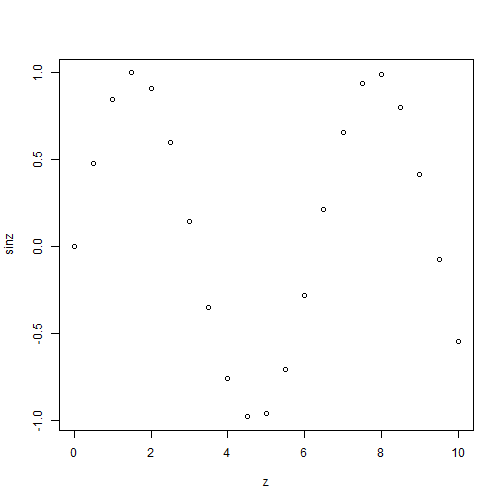
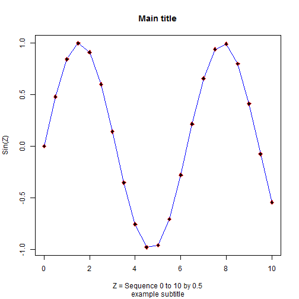
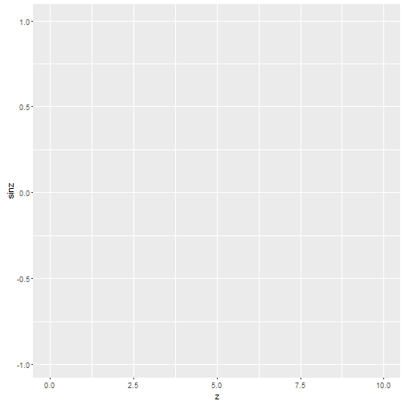
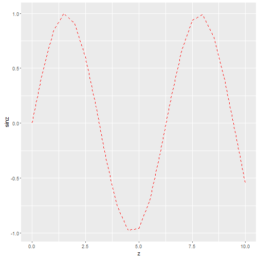
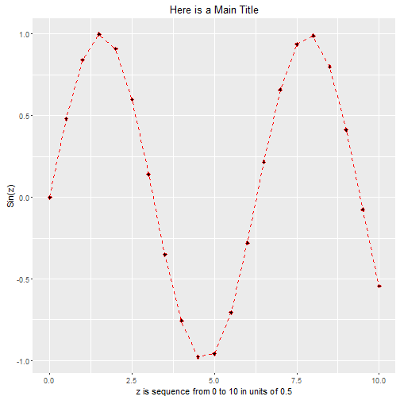
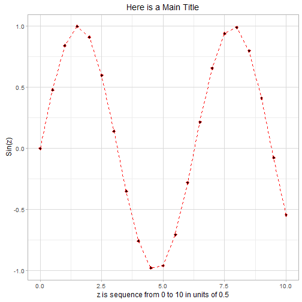
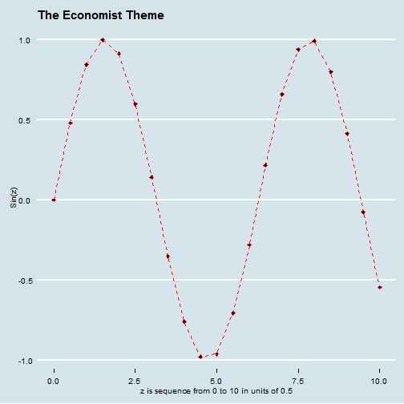
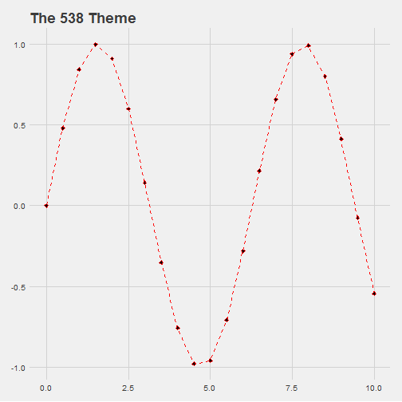
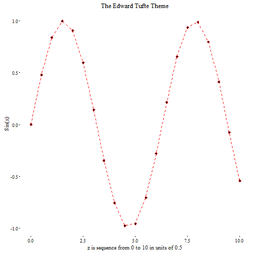
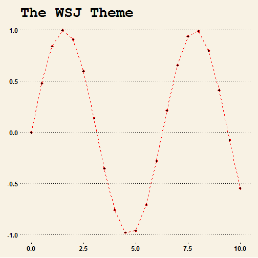

# Day1 Session 2
---

### Goals for Session 2

* View your data in R
* Getting started with plots and graphics in R including saving your plots out in various graphics formats
* Install and load new packages for added functionality in R
* Getting started with `ggplot2` a workhorse package for R graphics with added themes from the `ggthemes` package
* Learning how to cite the R base software and your added packages and listing your current session environment details and information.

--- 

## Ways to view or review data in objects

One way to view a data object is to use the `fix()` command. Running the following code will open a basic editor window (notepad) to view the object `z` and then the object `alist`.


```r
fix(z)
fix(alist1)
```

You've already seen that you can simply type the name of the object to view it in its entirety within the console. However, for larger datasets this can rapidly fill up your console and will significantly slow R down and may even cause R to crash or lock up. So, one way is to look aat only a small portion of the dataset such as the 1st few or the last few rows. We can do that using either the `head()` or `tail()` commands.

Let's look at the `head()` and `tail()` of the `df1` object you just created in EXERCISE 1 above.


```r
head(df1)
```

```
##   y month.name month.abb
## 1 1    January       Jan
## 2 2   February       Feb
## 3 3      March       Mar
## 4 4      April       Apr
## 5 5        May       May
## 6 6       June       Jun
```

```r
tail(df1)
```

```
##     y month.name month.abb
## 7   7       July       Jul
## 8   8     August       Aug
## 9   9  September       Sep
## 10 10    October       Oct
## 11 11   November       Nov
## 12 12   December       Dec
```

Another way to look at a given object is to simply use the data viewer. You can either click on the little table icon next to the object in the "Global Environment" window (top right) - OR you can run the `View()` command. You'll notice this command begins with a capital `V` and not the lowercase `v`. R is CaSe sensitive so always check. Try typing in `view(df1)` and see what happens.


```r
View(df1)
```


```r
view(df1)
```

```
## Error in eval(expr, envir, enclos): could not find function "view"
```

## Let's make a plot

So far we have created a numeric vector of 21 numbers sequence from 0 to 10 in units of 0.5. This was object `z`. We also created `sinz` which was the sine of these numbers. Let's make a plot of these together. 


```r
plot(z,sinz)
```



Let's add some more details to the plot. Look at the help pages for the plot function `help(plot)` to see what options are available. We'll use the code below to add a label to the x-axis, y-axis, plus a title and a subtitle.

We can also add a line and modify the points or markers in the plot. When you review the `help(plot)` help pages towards the bottom there is a "See Also" section which links to the functions `lines()` and `points()`. We'll use these 2 functions to add a colorful line and modify the points on our plot.


```r
plot(z, sinz, 
     xlab='Z = Sequence 0 to 10 by 0.5', 
     ylab='Sin(Z)', 
     main='Main title', 
     sub='example subtitle')

# add a BLUE line using lines()
lines(z,sinz,col='blue')

# customize the points using points()
# plotting character pch 23 is a filled diamond
# col defines the color
# bg defines the filled or background color
points(z,sinz,pch=23,col='red',bg='black')
```


Let's compile all of the code together into a single code block to make our plot.


```r
# select code above, right click and "run selection"
# or highlight code and click CTRL-R
# specifically run the following code all together
# the spaces and line returns added for clarity
# Note: RStudio helps with good formatting practices

plot(z, sinz,
     xlab = 'Z = Sequence 0 to 10 by 0.5',
     ylab = 'Sin(Z)',main='Main title',
     sub = 'example subtitle')
lines(z, sinz, col = 'blue')
points(z, sinz, pch = 23, col = 'red', bg = 'black')
```


## The graphics "Plots" window

In graphics "Plots" Window click on "Zoom". This will open the plot into a separate window. Once this window is open, you can right click and either copy the figure or save it. Within the "Plots" window itself you can also click on "Export". From here you can "Save As Image", "Save as PDF" or "Copy to Clipboard." The "Save as Image" gives you lots of options for saving the figure including: PNG, JPEG, TIFF, BMP, Metafile, SVG or EPS and you can change the figure size. _[Note: many journals request pastscript - EPS is the encapsulated postscript format.]_ When you "Copy to Clipboard" you also get options for copying the figure as either a Bitmap (pixel-by-pixel does not scale well) or a Metafile (which is a vectorized format and will scale well).

## Other ways to get graphics out and saved

There are command line ways to save graphical output. You can use any of the "Devices" that R supports. See `help()` on `Devices`. For example, suppose we wanted to save our figure above out as a PDF. We would use the `pdf()` device to do this. Here is the code. You'll notice I ran `dev.off()` at the end to be sure the device is turned back off. You MUST DO THIS for the final file to be created and your figure saved.


```r
pdf(file = "plot1.pdf")
plot(z, sinz,
     xlab = 'Z = Sequence 0 to 10 by 0.5',
     ylab = 'Sin(Z)',main='Main title',
     sub = 'example subtitle')
lines(z, sinz, col = 'blue')
points(z, sinz, pch = 23, col = 'red', bg = 'black')
dev.off()
```

```
## RStudioGD 
##         2
```

# EXERCISE 2

Look up which "device" will create and save the plot as a JPEG. Use the commands above as your guide and create and save the figure as a JPEG formatted file.

Create a second JPEG where the width is 750 pixels and the height is 500 pixels and set the background color to yellow and the quality to 50.

# ANSWER KEY for EXERCISE 2


```r
jpeg(file = "plot1.jpg")
plot(z, sinz,
     xlab = 'Z = Sequence 0 to 10 by 0.5',
     ylab = 'Sin(Z)',main='Main title',
     sub = 'example subtitle')
lines(z, sinz, col = 'blue')
points(z, sinz, pch = 23, col = 'red', bg = 'black')
dev.off()
```

```
## RStudioGD 
##         2
```

```r
jpeg(file = "plot1yellow.jpg", 
     width=750, height=500,
     bg = "yellow",
     quality = 50)
plot(z, sinz,
     xlab = 'Z = Sequence 0 to 10 by 0.5',
     ylab = 'Sin(Z)',main='Main title',
     sub = 'example subtitle')
lines(z, sinz, col = 'blue')
points(z, sinz, pch = 23, col = 'red', bg = 'black')
dev.off()
```

```
## RStudioGD 
##         2
```

## Adding packages

Just like SAS and SPSS have a base software to which you can add additional packages and "add-ons" to add additional functionality and features to your software, R comes with a base set of functions to which you can add literally thousands of packages and hundreds of thousands of additional functions and features.

As of March 8, 2016, there are 8054 packages available from [CRAN](https://cran.r-project.org/web/packages/). Many other packages are also available on Github. Hadley Wickham's "R Packages" book has some excellent information on writing and publishing your own packages. See [http://r-pkgs.had.co.nz/git.html](http://r-pkgs.had.co.nz/git.html). 

Still even more packages are available from [Bioconductor](https://www.bioconductor.org/). Currently, they list over 1104 pacakges available from their repositories.

### Let's install `ggplot2` package

`ggplot2` is another excellent graphics package by Hadley Wickham. The main CRAN site for this package is at [https://cran.r-project.org/web/packages/ggplot2/index.html](https://cran.r-project.org/web/packages/ggplot2/index.html). Hadley also has an entire website devoted to this package at [http://ggplot2.org/](http://ggplot2.org/) and he maintains the Github repository for package development at [https://github.com/hadley/ggplot2](https://github.com/hadley/ggplot2).

In general I recommend installing the most current version hosted at CRAN. We can do this using the menus "Tools"/"Install Packages". This opens a window where you can start typing in the package you want. RStudio will begin providing a list of packages that match that name and you can then pick the one you want and click "install." Take note of where on your hard drive the package is installed.

This process runs the following command which will also install the `ggplot2` package. 


```r
install.packages("ggplot2")
```

Before we can use the added functions in this new package, we must "load" the package into our R session. For this we use the `library()` command. You'll notice that we used `"` quotes when we typed in the name of the package in `install.packages()` but we leave these off when we call the `library()` command. _Yes, it is a nuiance of R..._


```r
library(ggplot2)
```

Let's look at the help window for this new package. Run the following code. 


```r
help(package = "ggplot2")
```

Now that we've got `ggplot2` loaded we can use these graphic options and functions to make our plot. Let's try the `qplot` function first. Look at the `help()` pages on `qplot()`. 

We put in `z` and `sinz` like we did last time, but now we can add in the points and lines as "geometrical objects or `geom`s. We can also add a label for the x-axis and y-axis using the `xlab` and `ylab` options and a title using the `main` option. We do not have a subtitle option here.


```r
qplot(z, sinz,
      geom = c("point", "line"),
      xlab = 'Z = Sequence 0 to 10 by 0.5',
      ylab = 'Sin(Z)',
      main = 'Main title')
```


## More with `ggplot2`

One of the nice things about `ggplot2` is the ability to build your plot with layers. The commands can be added in layers using the plus sign `+` to append.


```r
df2 <- data.frame(z,sinz)

ggplot(df2, aes(x=z, y=sinz)) +
  geom_line(colour = "red", linetype = "dashed") +
  geom_point(shape = 23,
             colour = "red",
             fill = "black") +
  xlab("z is sequence from 0 to 10 in units of 0.5") + 
  ylab("Sin(z)") +
  ggtitle("Here is a Main Title") + 
  theme_light()
```


Compare to our previous plot using the base R plot commands.


```r
plot(z, sinz,
     xlab = 'Z = Sequence 0 to 10 by 0.5',
     ylab = 'Sin(Z)',main='Main title',
     sub = 'example subtitle')
lines(z, sinz, col = 'blue')
points(z, sinz, pch = 23, col = 'red', bg = 'black')
```



## Build a plot piece by piece with `ggplot2`

1. create the new graphical object with `ggplot()` and assign it to a plot object we'll call `p`.


```r
p <- ggplot(df2, aes(x=z, y=sinz))
p
```



2. Add the geometrical object or `geom` that is a line using the `geom_line()` function. You could assign colors or other "aesthetics" to the line you are adding like line type.


```r
p <- p + geom_line(colour = "red", linetype = "dashed")
p
```



3. Add points with various aesthetics for the marker or point shape, as well as changing the color outline and fill color.


```r
p <- p + geom_point(shape = 23,
                    colour = "red",
                    fill = "black")
p
```


4. Next add a label for the x-axis using `xlab`, y-axis using `ylab` and add a title using `ggtitle`.


```r
p <- p + xlab("z is sequence from 0 to 10 in units of 0.5") +
  ylab("Sin(z)") + 
  ggtitle("Here is a Main Title")
p
```



5. You can also various themes to the plot. Here is one example adding the `theme_light()`.


```r
p <- p + theme_light()
p
```



## Let's add some creative themes to the plot

Jeffrey Arnold created the `ggthemes` package which has extra themes, geoms, and scales for 'ggplot2'. This package provides 'ggplot2' themes and scales that replicate the look of plots by Edward Tufte, Stephen Few, 'Fivethirtyeight', 'The Economist', 'Stata', 'Excel', and 'The Wall Street Journal', among others. Provides 'geoms' for Tufte's box plot and range frame. There is a helpful overview "vignette" at [https://cran.r-project.org/web/packages/ggthemes/vignettes/ggthemes.html](https://cran.r-project.org/web/packages/ggthemes/vignettes/ggthemes.html)


```r
library(ggthemes)
p <- p + theme_economist() + ggtitle("The Economist Theme")
p
```



```r
p <- p + theme_fivethirtyeight() + ggtitle("The 538 Theme")
p
```



```r
p <- p + theme_tufte() + ggtitle("The Edward Tufte Theme")
p
```



```r
p <- p + theme_wsj() + ggtitle("The Wall Street Journal Theme")
p
```




## Getting session information and citing packages and versions

When you use add-on packages it is always a good idea to make sure you list which version of R you are using and which version of each package you are using. YOu can cite the base software and the packages you are using with the following code. You will notice that each citation listed provides a typical format you might find in a journal plus the `BibTeX` citation, learn more at [http://www.bibtex.org/](http://www.bibtex.org/).  

To cite the base R package run `citation(package = "base")`. Here is the plain text citation. The BibTeX citation is not shown here - run the command to see the output in the console.

```
To cite R in publications use:

  R Core Team (2015). R: A language and environment for statistical
  computing. R Foundation for Statistical Computing, Vienna,
  Austria. URL https://www.R-project.org/.
```

Here is the citation for `ggplot2` by running `citation(package = "ggplot2")`.

```
To cite ggplot2 in publications, please use:

  H. Wickham. ggplot2: Elegant Graphics for Data Analysis.
  Springer-Verlag New York, 2009.

```

The `sessionInfo()` command shown below will also give you complete information on all packages and version running in your current session. Listing your `sessionInfo()` is a good idea when collaborating and sharing your code with others as this provides a snapshot of your computer system and your specific R environment and session settings. Here is info on my current session.


```r
sessionInfo()
```

```
## R version 3.2.3 (2015-12-10)
## Platform: x86_64-w64-mingw32/x64 (64-bit)
## Running under: Windows >= 8 x64 (build 9200)
## 
## locale:
## [1] LC_COLLATE=English_United States.1252 
## [2] LC_CTYPE=English_United States.1252   
## [3] LC_MONETARY=English_United States.1252
## [4] LC_NUMERIC=C                          
## [5] LC_TIME=English_United States.1252    
## 
## attached base packages:
## [1] stats     graphics  grDevices utils     datasets  methods   base     
## 
## other attached packages:
##  [1] plyr_1.8.3          dplyr_0.4.3         foreign_0.8-66     
##  [4] readxl_0.1.0        knitr_1.12.3        ggthemes_3.0.2     
##  [7] xkcd_0.0.5          extrafont_0.17      ggplot2_2.1.0      
## [10] knitcitations_1.0.7 Rgitbook_0.9       
## 
## loaded via a namespace (and not attached):
##  [1] Rcpp_0.12.3         RColorBrewer_1.1-2  formatR_1.2.1      
##  [4] highr_0.5.1         bitops_1.0-6        tools_3.2.3        
##  [7] rpart_4.1-10        digest_0.6.9        memoise_1.0.0      
## [10] lubridate_1.5.0     evaluate_0.8        gtable_0.1.2       
## [13] lattice_0.20-33     bibtex_0.4.0        DBI_0.3.1          
## [16] yaml_2.1.13         parallel_3.2.3      gridExtra_2.2.1    
## [19] Rttf2pt1_1.3.3      cluster_2.0.3       RefManageR_0.10.5  
## [22] httr_1.1.0          stringr_1.0.0       devtools_1.10.0    
## [25] nnet_7.3-11         grid_3.2.3          R6_2.1.2           
## [28] XML_3.98-1.3        survival_2.38-3     RJSONIO_1.3-0      
## [31] latticeExtra_0.6-28 Formula_1.2-1       extrafontdb_1.0    
## [34] magrittr_1.5        codetools_0.2-14    scales_0.3.0       
## [37] Hmisc_3.17-2        splines_3.2.3       assertthat_0.1     
## [40] colorspace_1.2-6    labeling_0.3        stringi_1.0-1      
## [43] acepack_1.3-3.3     RCurl_1.95-4.7      munsell_0.4.2
```


