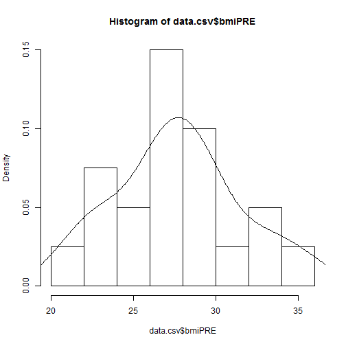

# Day1 Session 3
---

### Summary of Sessions 1 & 2

Here is what we've learned how to do so far:
* Quick introduction to Git and Github
* Quick overview of R, RStudio, how to install and get started
* Getting acquainted with R and the RStudio interface
* Using R codes to do math and run calculations
* Looking up the named constants in R and getting help
* Create different kinds of data objects in R
* Using commands and the Global Environment to understand the data object types and classes and structure
* Create lists and data frames built from other objects
* View your data in R
* Getting started with plots and graphics in R including saving your plots out in various graphics formats
* Install and load new packages for added functionality in R
* Getting started with `ggplot2` a workhorse package for R graphics with added themes from the `ggthemes` package
* Learning how to cite the R base software and your added packages and listing your current session environment details and information.
 
---

### Goals for Session 3

* a
* b
* c

---

## Managing and Cleaning up your environment as you go.

You can also remove objects as you go. This is especially helpful when working with (A) really large data files and objects and (B) if you are working with a large number of objects or with programs or functions that create many objects that you don't need long term (i.e. temporary files).

### Let's create some new objects:


```r
x <- 3 * 8 + 6
y <- 1:12
y2 <- y**2
```

Let's combine y and y2 both of which are vectors of length 12 with the 2 Constants month.abb and month.name. An easy way to do this is to use cbind() - but this will make (or coerce) ALL of the vectors to the same type. Here we're mixing numbers and characters, so R makes them all character variables. df1 is of "matrix" class type. A matrix in R has to have all elements in every row and column be the same type. In this case everything is now a character type. You can see this running the structure `str()` commands.

### Combine objects to make new objects
#### Create a Matrix Using `cbind()`


```r
df1 <- cbind(y, y2, month.abb, month.name)
class(df1)
```

```
## [1] "matrix"
```

```r
str(df1)
```

```
##  chr [1:12, 1:4] "1" "2" "3" "4" "5" "6" "7" "8" "9" ...
##  - attr(*, "dimnames")=List of 2
##   ..$ : NULL
##   ..$ : chr [1:4] "y" "y2" "month.abb" "month.name"
```

#### Create a Data Frame Using `data.frame()`

Another way to do this is using the `data.frame()` function. A data frame can handle multiple different data types at the same time. The `data frame` is actually a specical case of a `list` type which also mixes different types of objects and variables. Since `y`, `y2`, `month.abb` and `month.name` are all the same length of 12 - we can combine them together as follows. Data frames require the vectors to all be the same length.


```r
df1a <- data.frame(y,y2,month.abb,month.name)
class(df1a)
```

```
## [1] "data.frame"
```

```r
str(df1a)
```

```
## 'data.frame':	12 obs. of  4 variables:
##  $ y         : int  1 2 3 4 5 6 7 8 9 10 ...
##  $ y2        : num  1 4 9 16 25 36 49 64 81 100 ...
##  $ month.abb : Factor w/ 12 levels "Apr","Aug","Dec",..: 5 4 8 1 9 7 6 2 12 11 ...
##  $ month.name: Factor w/ 12 levels "April","August",..: 5 4 8 1 9 7 6 2 12 11 ...
```

#### Creating a Combination of Different Objects - different structure and different classes - Make a List using `list()`

Lists are a more general object type - you can mix and match types of variables and mix and match types of objects. In the example below we can combine 3 objects:
* `x` - a single number (vector of length 1)
* `y` - a integer vecotr of length 12
* `df1a` - the data frame we created above - so YES we have now put a data frame which is a special kind of list inside another list!


```r
list1 <- list(x,y,df1a)
class(list1)
```

```
## [1] "list"
```

```r
str(list1)
```

```
## List of 3
##  $ : num 30
##  $ : int [1:12] 1 2 3 4 5 6 7 8 9 10 ...
##  $ :'data.frame':	12 obs. of  4 variables:
##   ..$ y         : int [1:12] 1 2 3 4 5 6 7 8 9 10 ...
##   ..$ y2        : num [1:12] 1 4 9 16 25 36 49 64 81 100 ...
##   ..$ month.abb : Factor w/ 12 levels "Apr","Aug","Dec",..: 5 4 8 1 9 7 6 2 12 11 ...
##   ..$ month.name: Factor w/ 12 levels "April","August",..: 5 4 8 1 9 7 6 2 12 11 ...
```

### Selecting parts and subsets of objects
#### Selecting individual elements

For the matrix `df1` we created using `cbind()` above, we can "select" elements from inside `df1` as follows. You can select elements using the object name followed by brackets []. Inside the brackets you put in 2 values - the row number followed by the column number separated by a comma. Let's select the ELEMENT in row 3, column 3 of `df1`.


```r
df1[3,3]
```

```
## month.abb 
##     "Mar"
```

#### Select a COLUMN

We can also select a whole column by leaving the row value empty which implies to select all rows and then only provide the column number after the comma. Let's select COLUMN 3 of `df1`.


```r
df1[,3]
```

```
##  [1] "Jan" "Feb" "Mar" "Apr" "May" "Jun" "Jul" "Aug" "Sep" "Oct" "Nov"
## [12] "Dec"
```

#### Select a ROW

We can also select a whole row by leaving the column value empty which implies to select all columns and then only provide the row number before the comma. Let's select ROW 5 of `df1`.


```r
df1[5,]
```

```
##          y         y2  month.abb month.name 
##        "5"       "25"      "May"      "May"
```

### Compare class types of variables

As we noted above ALL of the elements in `df1` are character type becuase we used the `cbind()` command and we mixed numeric and character type vectors. We can confirm this by using the `class()` and `str()` functions to see the class and structure of the 1st column of `df1`.


```r
df1[,1]
```

```
##  [1] "1"  "2"  "3"  "4"  "5"  "6"  "7"  "8"  "9"  "10" "11" "12"
```

```r
class(df1[,1])
```

```
## [1] "character"
```

```r
str(df1[,1])
```

```
##  chr [1:12] "1" "2" "3" "4" "5" "6" "7" "8" "9" ...
```

Let's compare this with the 1st column of `df1a` which was created using the `data.frame()` command where the types of vectors could be mixed together. So the `class()` and `str()` of `df1a[,1]` should be an integer type instead of character type.


```r
df1a[,1]
```

```
##  [1]  1  2  3  4  5  6  7  8  9 10 11 12
```

```r
class(df1a[,1])
```

```
## [1] "integer"
```

```r
str(df1a[,1])
```

```
##  int [1:12] 1 2 3 4 5 6 7 8 9 10 ...
```

### Create some more objects

We'll also create `z` and `sinz` and then combine them together using `data.frame()` to make one more data frame object `df2`.


```r
z <- seq(0,10,.5)
sinz <- sin(z)
df2 <- data.frame(z, sinz)
```

### Clean up redundant objects

Notice that we created `y` and `y2` and included these in matrix `df1` and in data frame `df1a`. So, now we have the same data/information in 2 places which is redundant. We could remove `y` and `y2` since they are now contained inside `df1` and in `df1a`. Similarly, we created `z` and `sinz` which are now also contained inside `df2`. So, let's **clean** up our environment by removing `y`, `y2`, `z`, `sinz`. 

Let's list the current list of objects and then remove these and list the objects again.


```r
ls()
```

```
##  [1] "a1"         "a1to5cbind" "a1to5df"    "a1to5dfnf"  "a1to5list" 
##  [6] "a1to5rbind" "a2"         "a3"         "a4"         "a5"        
## [11] "alist1"     "bib"        "df1"        "df1a"       "df2"       
## [16] "list1"      "p"          "sinz"       "x"          "y"         
## [21] "y2"         "z"
```

```r
rm(y, y2, z, sinz)
ls()
```

```
##  [1] "a1"         "a1to5cbind" "a1to5df"    "a1to5dfnf"  "a1to5list" 
##  [6] "a1to5rbind" "a2"         "a3"         "a4"         "a5"        
## [11] "alist1"     "bib"        "df1"        "df1a"       "df2"       
## [16] "list1"      "p"          "x"
```

### More on selecting elements in objects

Let's select the 1st column of df2. In addition to using the brackets [] you can also SELECT variables in lists or in data frames by using the $ dollar sign which is another selector in R. Also you can put comments after code.


```r
df2[,1] # use the column number
```

```
##  [1]  0.0  0.5  1.0  1.5  2.0  2.5  3.0  3.5  4.0  4.5  5.0  5.5  6.0  6.5
## [15]  7.0  7.5  8.0  8.5  9.0  9.5 10.0
```

```r
df2$z # select by column name
```

```
##  [1]  0.0  0.5  1.0  1.5  2.0  2.5  3.0  3.5  4.0  4.5  5.0  5.5  6.0  6.5
## [15]  7.0  7.5  8.0  8.5  9.0  9.5 10.0
```

You can combine these selectors. Here we'll use the $ dollar sign to select the column "month.name" in `df1a`. Once that column is selected, we can use the brackets to pull out the 3rd element in this column variable - this should be the month name "March". NOTE: This variable is technically a factor so ignore the 2nd line of output below which says there are 12 levels. Factors will be explained later.


```r
df1a$month.name[3]
```

```
## [1] March
## 12 Levels: April August December February January July June March ... September
```

### Saving objects, workspace and datasets

You can save all of these objects as a `*.RData` file which saves the workspace with all of the objects into 1 file. This can be achieved a couple of ways. In the Global Enviroment window (top right) you can click on the "save disk" icon. This can also be achieved through the menus at Session/Save Workspace As. You can also run the `save()` or `save.image()` functions.

Let's use the `save.image()` function:


```r
save.image("allobjects.RData")
```

We could also save individual objects as `*.RData` files. For example suppose we wanted to save the 2nd data frame `df2`, we would use the `save()` function.


```r
save(df2, file="df2.RData")
```

Look in your current working directory and make sure that you now see both of these files: <br> <br> `allobjects.RData` <br> and <br> `df2.RData`

Now that we know these files have been saved, let's remove them from our environment and add them back in. We will use the `load()` command to read these data back into our environment.

First clear the environment:


```r
rm(list = ls())
```

Then `load()` the data back. Let's load `df2.RData` first and then the complete workspace `allobjects.RData`.


```r
load(file="df2.RData")
```

Next the full workspace. NOTE: Ignore the `bib` object shown below which is created as part of this RGitbook.


```r
load("allobjects.RData")
```


```r
ls()
```

```
##  [1] "a1"         "a1to5cbind" "a1to5df"    "a1to5dfnf"  "a1to5list" 
##  [6] "a1to5rbind" "a2"         "a3"         "a4"         "a5"        
## [11] "alist1"     "bib"        "df1"        "df1a"       "df2"       
## [16] "list1"      "p"          "x"
```


You have now successfully accomplished the following:
* created data objects in R
* saved your entire workspace collection of objects
* saved a specific data frame object
* cleared your workspace
* loaded back the specific data frame object
* and loaded back your entire workspace

Next - let's load or import external data files (such as from Excel, CSV and SPSS) and save them back out.

## Example Datafiles

I have created a simple dataset for us to work with. The files are available via Dropbox at [https://www.dropbox.com/sh/vlo5bzrl5ayo1bk/AADD0WieyuEdyGwiveuCoRr-a?dl=0](https://www.dropbox.com/sh/vlo5bzrl5ayo1bk/AADD0WieyuEdyGwiveuCoRr-a?dl=0)

The data files include:
* XLS - the older 1997-2003 EXCEL file format
* XLSX - the newer EXCEL file workbook format
* CSV - a comma delimited dataset
* xxx_tab.TXT - a TAB delimited dataset
* SAV - SPSS file format
* and R scripts (xxx.R) for Workshops 1 and 2 so far...

We will work through importing each of these datafile types.

---

## The dataset description

The dataset we'll be working with here has 8 variables and 20 cases (or 20 subjects).

<table>
 <thead>
  <tr>
   <th style="text-align:right;"> SubjectID </th>
   <th style="text-align:right;"> Age </th>
   <th style="text-align:right;"> WeightPRE </th>
   <th style="text-align:right;"> WeightPOST </th>
   <th style="text-align:right;"> Height </th>
   <th style="text-align:right;"> SES </th>
   <th style="text-align:right;"> GenderSTR </th>
   <th style="text-align:right;"> GenderCoded </th>
  </tr>
 </thead>
<tbody>
  <tr>
   <td style="text-align:right;"> 1 </td>
   <td style="text-align:right;"> 45 </td>
   <td style="text-align:right;"> 150 </td>
   <td style="text-align:right;"> 145 </td>
   <td style="text-align:right;"> 5.6 </td>
   <td style="text-align:right;"> 2 </td>
   <td style="text-align:right;"> m </td>
   <td style="text-align:right;"> 1 </td>
  </tr>
  <tr>
   <td style="text-align:right;"> 2 </td>
   <td style="text-align:right;"> 50 </td>
   <td style="text-align:right;"> 167 </td>
   <td style="text-align:right;"> 166 </td>
   <td style="text-align:right;"> 5.4 </td>
   <td style="text-align:right;"> 2 </td>
   <td style="text-align:right;"> f </td>
   <td style="text-align:right;"> 2 </td>
  </tr>
  <tr>
   <td style="text-align:right;"> 3 </td>
   <td style="text-align:right;"> 35 </td>
   <td style="text-align:right;"> 143 </td>
   <td style="text-align:right;"> 135 </td>
   <td style="text-align:right;"> 5.6 </td>
   <td style="text-align:right;"> 2 </td>
   <td style="text-align:right;"> F </td>
   <td style="text-align:right;"> 2 </td>
  </tr>
  <tr>
   <td style="text-align:right;"> 4 </td>
   <td style="text-align:right;"> 44 </td>
   <td style="text-align:right;"> 216 </td>
   <td style="text-align:right;"> 201 </td>
   <td style="text-align:right;"> 5.6 </td>
   <td style="text-align:right;"> 2 </td>
   <td style="text-align:right;"> m </td>
   <td style="text-align:right;"> 1 </td>
  </tr>
  <tr>
   <td style="text-align:right;"> 5 </td>
   <td style="text-align:right;"> 32 </td>
   <td style="text-align:right;"> 243 </td>
   <td style="text-align:right;"> 223 </td>
   <td style="text-align:right;"> 6.0 </td>
   <td style="text-align:right;"> 2 </td>
   <td style="text-align:right;"> m </td>
   <td style="text-align:right;"> 1 </td>
  </tr>
  <tr>
   <td style="text-align:right;"> 6 </td>
   <td style="text-align:right;"> 48 </td>
   <td style="text-align:right;"> 165 </td>
   <td style="text-align:right;"> 145 </td>
   <td style="text-align:right;"> 5.2 </td>
   <td style="text-align:right;"> 2 </td>
   <td style="text-align:right;"> f </td>
   <td style="text-align:right;"> 2 </td>
  </tr>
  <tr>
   <td style="text-align:right;"> 7 </td>
   <td style="text-align:right;"> 50 </td>
   <td style="text-align:right;"> 132 </td>
   <td style="text-align:right;"> 132 </td>
   <td style="text-align:right;"> 5.3 </td>
   <td style="text-align:right;"> 2 </td>
   <td style="text-align:right;"> m </td>
   <td style="text-align:right;"> 1 </td>
  </tr>
  <tr>
   <td style="text-align:right;"> 8 </td>
   <td style="text-align:right;"> 51 </td>
   <td style="text-align:right;"> 110 </td>
   <td style="text-align:right;"> 108 </td>
   <td style="text-align:right;"> 5.1 </td>
   <td style="text-align:right;"> 3 </td>
   <td style="text-align:right;"> f </td>
   <td style="text-align:right;"> 2 </td>
  </tr>
  <tr>
   <td style="text-align:right;"> 9 </td>
   <td style="text-align:right;"> 46 </td>
   <td style="text-align:right;"> 167 </td>
   <td style="text-align:right;"> 158 </td>
   <td style="text-align:right;"> 5.5 </td>
   <td style="text-align:right;"> 2 </td>
   <td style="text-align:right;">  </td>
   <td style="text-align:right;"> NA </td>
  </tr>
  <tr>
   <td style="text-align:right;"> 10 </td>
   <td style="text-align:right;"> 35 </td>
   <td style="text-align:right;"> 190 </td>
   <td style="text-align:right;"> 200 </td>
   <td style="text-align:right;"> 5.8 </td>
   <td style="text-align:right;"> 1 </td>
   <td style="text-align:right;"> Male </td>
   <td style="text-align:right;"> 1 </td>
  </tr>
  <tr>
   <td style="text-align:right;"> 11 </td>
   <td style="text-align:right;"> 36 </td>
   <td style="text-align:right;"> 230 </td>
   <td style="text-align:right;"> 210 </td>
   <td style="text-align:right;"> 6.2 </td>
   <td style="text-align:right;"> 1 </td>
   <td style="text-align:right;"> m </td>
   <td style="text-align:right;"> 1 </td>
  </tr>
  <tr>
   <td style="text-align:right;"> 12 </td>
   <td style="text-align:right;"> 40 </td>
   <td style="text-align:right;"> 200 </td>
   <td style="text-align:right;"> 195 </td>
   <td style="text-align:right;"> 6.1 </td>
   <td style="text-align:right;"> 1 </td>
   <td style="text-align:right;"> f </td>
   <td style="text-align:right;"> 2 </td>
  </tr>
  <tr>
   <td style="text-align:right;"> 13 </td>
   <td style="text-align:right;"> 45 </td>
   <td style="text-align:right;"> 180 </td>
   <td style="text-align:right;"> 185 </td>
   <td style="text-align:right;"> 5.9 </td>
   <td style="text-align:right;"> 3 </td>
   <td style="text-align:right;"> f </td>
   <td style="text-align:right;"> 2 </td>
  </tr>
  <tr>
   <td style="text-align:right;"> 14 </td>
   <td style="text-align:right;"> 52 </td>
   <td style="text-align:right;"> 240 </td>
   <td style="text-align:right;"> 220 </td>
   <td style="text-align:right;"> 6.5 </td>
   <td style="text-align:right;"> 2 </td>
   <td style="text-align:right;"> m </td>
   <td style="text-align:right;"> 1 </td>
  </tr>
  <tr>
   <td style="text-align:right;"> 15 </td>
   <td style="text-align:right;"> 24 </td>
   <td style="text-align:right;"> 250 </td>
   <td style="text-align:right;"> 240 </td>
   <td style="text-align:right;"> 6.4 </td>
   <td style="text-align:right;"> 2 </td>
   <td style="text-align:right;"> M </td>
   <td style="text-align:right;"> 1 </td>
  </tr>
  <tr>
   <td style="text-align:right;"> 16 </td>
   <td style="text-align:right;"> 35 </td>
   <td style="text-align:right;"> 175 </td>
   <td style="text-align:right;"> 174 </td>
   <td style="text-align:right;"> 5.8 </td>
   <td style="text-align:right;"> 2 </td>
   <td style="text-align:right;"> F </td>
   <td style="text-align:right;"> 2 </td>
  </tr>
  <tr>
   <td style="text-align:right;"> 17 </td>
   <td style="text-align:right;"> 51 </td>
   <td style="text-align:right;"> 220 </td>
   <td style="text-align:right;"> 221 </td>
   <td style="text-align:right;"> 6.3 </td>
   <td style="text-align:right;"> 2 </td>
   <td style="text-align:right;"> m </td>
   <td style="text-align:right;"> 1 </td>
  </tr>
  <tr>
   <td style="text-align:right;"> 18 </td>
   <td style="text-align:right;"> 43 </td>
   <td style="text-align:right;"> 230 </td>
   <td style="text-align:right;"> 215 </td>
   <td style="text-align:right;"> 2.6 </td>
   <td style="text-align:right;"> 2 </td>
   <td style="text-align:right;"> m </td>
   <td style="text-align:right;"> 1 </td>
  </tr>
  <tr>
   <td style="text-align:right;"> 19 </td>
   <td style="text-align:right;"> 36 </td>
   <td style="text-align:right;"> 190 </td>
   <td style="text-align:right;"> 180 </td>
   <td style="text-align:right;"> 5.7 </td>
   <td style="text-align:right;"> 1 </td>
   <td style="text-align:right;"> female </td>
   <td style="text-align:right;"> 2 </td>
  </tr>
  <tr>
   <td style="text-align:right;"> 20 </td>
   <td style="text-align:right;"> 44 </td>
   <td style="text-align:right;"> 260 </td>
   <td style="text-align:right;"> 240 </td>
   <td style="text-align:right;"> 6.4 </td>
   <td style="text-align:right;"> 3 </td>
   <td style="text-align:right;"> male </td>
   <td style="text-align:right;"> 1 </td>
  </tr>
</tbody>
</table>


## IMPORT a basic CSV (comma delimited) or TAB (TAB delimited) text data file

Let's import a simple data file in CSV (comma delimited) format. This is the most common simple format used for exchanging data between different software/data handling packages.

In basic R the following functions are useful for reading in or importing in datasets:
* `read.table()`
* `read.csv()` 
* `read.delim()`

For each of these files you need to specify the data file, and possibly also supply whether the dataset has a header row, what the separator character is and more options. To see complete details see `help(read.table)`

For each example below, I am providing the specific directory path. However, if these datafiles are located in your current working directory you can just type the filename without the full path.

### Option 1 - use `read.table()`

The basic code is `read.table(file="xxx", header=TRUE, sep=",")` but these options can be changed as needed if your file does not have a header row or if your file has a separator other than a comma - some separators can be spaces or tabs.


```r
data.rt <- read.table(file="C:/MyGithub/CDCRworkshop/datasets/Dataset_01_comma.csv",header=TRUE,sep=",")
data.rt
```

```
##    SubjectID Age WeightPRE WeightPOST Height SES GenderSTR GenderCoded
## 1          1  45       150        145    5.6   2         m           1
## 2          2  50       167        166    5.4   2         f           2
## 3          3  35       143        135    5.6   2         F           2
## 4          4  44       216        201    5.6   2         m           1
## 5          5  32       243        223    6.0   2         m           1
## 6          6  48       165        145    5.2   2         f           2
## 7          7  50       132        132    5.3   2         m           1
## 8          8  51       110        108    5.1   3         f           2
## 9          9  46       167        158    5.5   2                    NA
## 10        10  35       190        200    5.8   1      Male           1
## 11        11  36       230        210    6.2   1         m           1
## 12        12  40       200        195    6.1   1         f           2
## 13        13  45       180        185    5.9   3         f           2
## 14        14  52       240        220    6.5   2         m           1
## 15        15  24       250        240    6.4   2         M           1
## 16        16  35       175        174    5.8   2         F           2
## 17        17  51       220        221    6.3   2         m           1
## 18        18  43       230        215    2.6   2         m           1
## 19        19  36       190        180    5.7   1    female           2
## 20        20  44       260        240    6.4   3      male           1
```

### Option 2 - use `read.csv()`

Option 2 assumes that there is a header row and the datafile uses a comma separator.


```r
data.csv <- read.csv(file="C:/MyGithub/CDCRworkshop/datasets/Dataset_01_comma.csv")
data.csv
```

```
##    SubjectID Age WeightPRE WeightPOST Height SES GenderSTR GenderCoded
## 1          1  45       150        145    5.6   2         m           1
## 2          2  50       167        166    5.4   2         f           2
## 3          3  35       143        135    5.6   2         F           2
## 4          4  44       216        201    5.6   2         m           1
## 5          5  32       243        223    6.0   2         m           1
## 6          6  48       165        145    5.2   2         f           2
## 7          7  50       132        132    5.3   2         m           1
## 8          8  51       110        108    5.1   3         f           2
## 9          9  46       167        158    5.5   2                    NA
## 10        10  35       190        200    5.8   1      Male           1
## 11        11  36       230        210    6.2   1         m           1
## 12        12  40       200        195    6.1   1         f           2
## 13        13  45       180        185    5.9   3         f           2
## 14        14  52       240        220    6.5   2         m           1
## 15        15  24       250        240    6.4   2         M           1
## 16        16  35       175        174    5.8   2         F           2
## 17        17  51       220        221    6.3   2         m           1
## 18        18  43       230        215    2.6   2         m           1
## 19        19  36       190        180    5.7   1    female           2
## 20        20  44       260        240    6.4   3      male           1
```

### Option 3 - use `read.delim()`

Option 3 assumes that there is a header row and the datafile uses a TAB separator.


```r
data.tab <- read.delim(file="C:/MyGithub/CDCRworkshop/datasets/Dataset_01_tab.txt")
data.tab
```

```
##    SubjectID Age WeightPRE WeightPOST Height SES GenderSTR GenderCoded
## 1          1  45       150        145    5.6   2         m           1
## 2          2  50       167        166    5.4   2         f           2
## 3          3  35       143        135    5.6   2         F           2
## 4          4  44       216        201    5.6   2         m           1
## 5          5  32       243        223    6.0   2         m           1
## 6          6  48       165        145    5.2   2         f           2
## 7          7  50       132        132    5.3   2         m           1
## 8          8  51       110        108    5.1   3         f           2
## 9          9  46       167        158    5.5   2                    NA
## 10        10  35       190        200    5.8   1      Male           1
## 11        11  36       230        210    6.2   1         m           1
## 12        12  40       200        195    6.1   1         f           2
## 13        13  45       180        185    5.9   3         f           2
## 14        14  52       240        220    6.5   2         m           1
## 15        15  24       250        240    6.4   2         M           1
## 16        16  35       175        174    5.8   2         F           2
## 17        17  51       220        221    6.3   2         m           1
## 18        18  43       230        215    2.6   2         m           1
## 19        19  36       190        180    5.7   1    female           2
## 20        20  44       260        240    6.4   3      male           1
```

## IMPORT data from an EXCEL file XLS and XLSX formats

We will use the `readxl` package. Be sure to install this package `install.package("readxl")` and then load it using `library(readxl)`.

Here is code for reading in a XLS format


```r
data.xls <- read_excel("C:/MyGithub/CDCRworkshop/datasets/Dataset_01.xls", sheet=1)
data.xls
```

```
## Source: local data frame [20 x 8]
## 
##    SubjectID   Age WeightPRE WeightPOST Height   SES GenderSTR GenderCoded
##        (dbl) (dbl)     (dbl)      (dbl)  (dbl) (dbl)     (chr)       (dbl)
## 1          1    45       150        145    5.6     2         m           1
## 2          2    50       167        166    5.4     2         f           2
## 3          3    35       143        135    5.6     2         F           2
## 4          4    44       216        201    5.6     2         m           1
## 5          5    32       243        223    6.0     2         m           1
## 6          6    48       165        145    5.2     2         f           2
## 7          7    50       132        132    5.3     2         m           1
## 8          8    51       110        108    5.1     3         f           2
## 9          9    46       167        158    5.5     2        NA          NA
## 10        10    35       190        200    5.8     1      Male           1
## 11        11    36       230        210    6.2     1         m           1
## 12        12    40       200        195    6.1     1         f           2
## 13        13    45       180        185    5.9     3         f           2
## 14        14    52       240        220    6.5     2         m           1
## 15        15    24       250        240    6.4     2         M           1
## 16        16    35       175        174    5.8     2         F           2
## 17        17    51       220        221    6.3     2         m           1
## 18        18    43       230        215    2.6     2         m           1
## 19        19    36       190        180    5.7     1    female           2
## 20        20    44       260        240    6.4     3      male           1
```

Here is code for reading in a XLSX format


```r
data.xlsx <- read_excel("C:/MyGithub/CDCRworkshop/datasets/Dataset_01.xlsx", sheet=1)
data.xlsx
```

```
## Source: local data frame [20 x 8]
## 
##    SubjectID   Age WeightPRE WeightPOST Height   SES GenderSTR GenderCoded
##        (dbl) (dbl)     (dbl)      (dbl)  (dbl) (dbl)     (chr)       (dbl)
## 1          1    45       150        145    5.6     2         m           1
## 2          2    50       167        166    5.4     2         f           2
## 3          3    35       143        135    5.6     2         F           2
## 4          4    44       216        201    5.6     2         m           1
## 5          5    32       243        223    6.0     2         m           1
## 6          6    48       165        145    5.2     2         f           2
## 7          7    50       132        132    5.3     2         m           1
## 8          8    51       110        108    5.1     3         f           2
## 9          9    46       167        158    5.5     2        NA          NA
## 10        10    35       190        200    5.8     1      Male           1
## 11        11    36       230        210    6.2     1         m           1
## 12        12    40       200        195    6.1     1         f           2
## 13        13    45       180        185    5.9     3         f           2
## 14        14    52       240        220    6.5     2         m           1
## 15        15    24       250        240    6.4     2         M           1
## 16        16    35       175        174    5.8     2         F           2
## 17        17    51       220        221    6.3     2         m           1
## 18        18    43       230        215    2.6     2         m           1
## 19        19    36       190        180    5.7     1    female           2
## 20        20    44       260        240    6.4     3      male           1
```

## IMPORT data from a SPSS file in SAV format

In order to read datafiles from SPSS, other statistical software, and many other datafile types. To see detailed info look at help for the `foreign` package. Remember to `install.packages("foreign")` and load the package using `library(foreign)`. Run the following code to see details on this package and all the formats supported:

```
help(package = "foreign")
```
We will use this package to read in an SPSS datafile in the SAV format. The function we will use is `read.spss()`. See more detailed information on the various options by running `help(read.spss)`. For now we will specify the filename and tell the function to make sure the file is output as a data frame object using the `to.data.frame` option set to `TRUE`.


```r
data.spss <- read.spss(file = "C:/MyGithub/CDCRworkshop/datasets/Dataset_01.sav",
                       to.data.frame=TRUE)
data.spss
```

```
##    SubjectID Age WeightPRE WeightPOST Height            SES
## 1          1  45       150        145    5.6 Average Income
## 2          2  50       167        166    5.4 Average Income
## 3          3  35       143        135    5.6 Average Income
## 4          4  44       216        201    5.6 Average Income
## 5          5  32       243        223    6.0 Average Income
## 6          6  48       165        145    5.2 Average Income
## 7          7  50       132        132    5.3 Average Income
## 8          8  51       110        108    5.1    High Income
## 9          9  46       167        158    5.5 Average Income
## 10        10  35       190        200    5.8     Low Income
## 11        11  36       230        210    6.2     Low Income
## 12        12  40       200        195    6.1     Low Income
## 13        13  45       180        185    5.9    High Income
## 14        14  52       240        220    6.5 Average Income
## 15        15  24       250        240    6.4 Average Income
## 16        16  35       175        174    5.8 Average Income
## 17        17  51       220        221    6.3 Average Income
## 18        18  43       230        215    6.2 Average Income
## 19        19  36       190        180    5.7     Low Income
## 20        20  44       260        240    6.4    High Income
##                   GenderSTR GenderCoded
## 1  m                               Male
## 2  f                             Female
## 3  F                             Female
## 4  m                               Male
## 5  m                               Male
## 6  f                             Female
## 7  m                               Male
## 8  f                             Female
## 9                                  <NA>
## 10 Male                            Male
## 11 m                               Male
## 12 f                             Female
## 13 f                             Female
## 14 m                               Male
## 15 M                               Male
## 16 F                             Female
## 17 m                               Male
## 18 m                               Male
## 19 female                        Female
## 20 male                            Male
```

## Create some new variables and save the output

In the datafile we have weights measures at 2 time points and we have height. We can use this data to compute BMI. Since weight is in pounds and height is in inches, we can use the following formula:

`BMI_PRE=(WeightPRE*703)/((Height*12)*(Height*12))`

From here let's work with `data.csv`. Since we have weights and height we can compute BMI. Let's do that here with weights in pounds and height in decminal feet which we'll convert to inches in the formula given here. You'll notice that I'm selecting the variables using the $ dollar sign. I'm also creating 2 NEW variables `bmiPRE` and `bmiPOST`. By creating them on the left side of the `<-` and using the $ this automatically APPENDS these new variables to the exisiting data frame `data.csv`. When we do this the data frame `data.csv` will go from having 8 variables to 9 and then to 10. Watch the global environment window as you run each line of code below.


```r
data.csv$bmiPRE <- (data.csv$WeightPRE*703)/((data.csv$Height*12)**2)
```

And we'll do it again for the POST weights:

`BMI_POST=(WeightPOST*703)/((Height*12)*(Height*12))`


```r
data.csv$bmiPOST <- (data.csv$WeightPOST*703)/((data.csv$Height*12)**2)
```

#### Isn't there an easier way besides using $?

So, yes, it is a pain to have to type in the data frame followed by a dollar sign $ and then the variable name. If you know for sure you're going to mainly be working with one data frame, you can ATTACH the variables inside data frame to your current environment so you can access the variables withouth having to type the name of the data frame and $ each time. For more info see this blog post at R-boggers [http://www.r-bloggers.com/to-attach-or-not-attach-that-is-the-question/](http://www.r-bloggers.com/to-attach-or-not-attach-that-is-the-question/)

Once we attach the dataset, you can call the variables directly. See example below to compute the change in BMI from PRE-to-POST and then find the mean of these differences.


```r
attach(data.csv)

diff <- bmiPOST - bmiPRE
mean(diff)
```

```
## [1] -1.598245
```

```r
detach(data.csv)
```

**ALWAYS remember to DETACH your data frame when finished.**

Now that we have a new variable created the `diff` object, it is sitting in the global environment not attached to the original data frame. We can add it to the data frame `data.csv` as follows:


```r
data.csv$diff <- diff
```

Now that we've updated our dataset, let's save it using the basic `save()` function - we can save it as a R formatted file `xxx.RData`

## EXPORT or SAVE the updated data

We can save it out as a RData file using the `save()` function.


```r
save(data.csv, 
     file="C:/MyGithub/CDCRworkshop/datasets/datacsv.RData")
```

Save the data out in a delimited format. First we'll do a comma delimited CSV file using `write.csv()`.


```r
write.csv(data.csv, 
          file="C:/MyGithub/CDCRworkshop/datasets/datacsv.csv")
```

Next we'll do a TAB delimited text file using the `write.table()`.


```r
write.table(data.csv, 
          file="C:/MyGithub/CDCRworkshop/datasets/datacsv.txt",
          sep="\t")
```


Now that we've read data in and exported data out of R, let's run some simple stat summaries.

## Some simple statistics

The `summary()` function is a quick simple way to get basic summary statistics on every variable in a dataset.


```r
data.csv <- read.csv(file="C:/MyGithub/CDCRworkshop/datasets/Dataset_01_comma.csv")
summary(data.csv)
```

```
##    SubjectID          Age          WeightPRE       WeightPOST   
##  Min.   : 1.00   Min.   :24.00   Min.   :110.0   Min.   :108.0  
##  1st Qu.: 5.75   1st Qu.:35.75   1st Qu.:166.5   1st Qu.:154.8  
##  Median :10.50   Median :44.00   Median :190.0   Median :190.0  
##  Mean   :10.50   Mean   :42.10   Mean   :192.9   Mean   :184.7  
##  3rd Qu.:15.25   3rd Qu.:48.50   3rd Qu.:230.0   3rd Qu.:216.2  
##  Max.   :20.00   Max.   :52.00   Max.   :260.0   Max.   :240.0  
##                                                                 
##      Height           SES         GenderSTR  GenderCoded   
##  Min.   :2.600   Min.   :1.00   m      :8   Min.   :1.000  
##  1st Qu.:5.475   1st Qu.:2.00   f      :5   1st Qu.:1.000  
##  Median :5.750   Median :2.00   F      :2   Median :1.000  
##  Mean   :5.650   Mean   :1.95          :1   Mean   :1.421  
##  3rd Qu.:6.125   3rd Qu.:2.00   female :1   3rd Qu.:2.000  
##  Max.   :6.500   Max.   :3.00   M      :1   Max.   :2.000  
##                                 (Other):2   NA's   :1
```

Let's make a histogram of the BMI's at PRE


```r
data.csv$bmiPRE <- (data.csv$WeightPRE*703)/((data.csv$Height*12)**2)
data.csv$bmiPOST <- (data.csv$WeightPOST*703)/((data.csv$Height*12)**2)
hist(data.csv$bmiPRE)
```


There is a typo, so let's fix the Height typo for subject 18. It is currently entered as 2.6 and should be 5.6. After fixing it we will update the BMI calculations and then replot the histogram.

We will also overlay a density curve.


```r
data.csv[18,"Height"] <- 5.6
data.csv$bmiPRE <- (data.csv$WeightPRE*703)/((data.csv$Height*12)**2)
data.csv$bmiPOST <- (data.csv$WeightPOST*703)/((data.csv$Height*12)**2)
hist(data.csv$bmiPRE, freq=FALSE)
lines(density(data.csv$bmiPRE))
```



Let's also make a quick scatterplot of BMI at PRE and POST and we'll overlay a linear best fit line using the `lm()` function and a non-parametric smoothed line using the `lowess()` function. We'll wrap the linear fit results with the `abline()` line function to overlay the best fit line and we'll use the `lines()` function to overlay the smoothed line.


```r
plot(data.csv$bmiPRE, data.csv$bmiPOST, "p")
abline(lm(data.csv$bmiPOST ~ data.csv$bmiPRE), col="red")
lines(lowess(data.csv$bmiPRE, data.csv$bmiPOST), col="blue")
```


