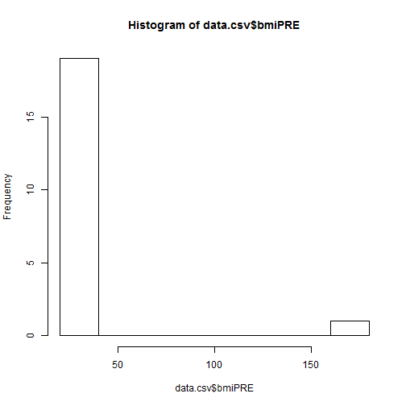
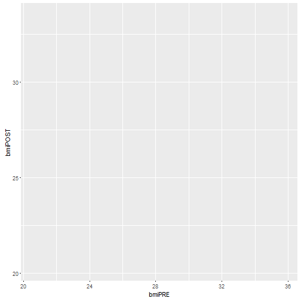
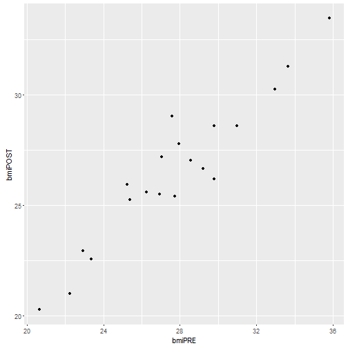
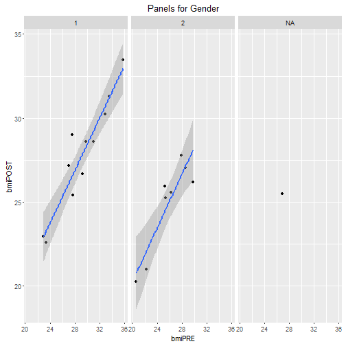
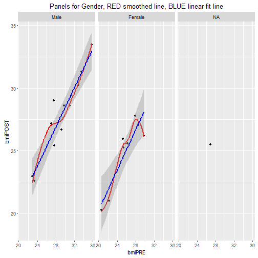
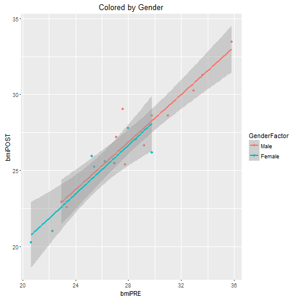

# Day1 Session 4
---

### Goals for Session 4

* now that data is read in, create new variables (BMI from Ht and Wt)
* learn how to attach and detach datasets - temporary loading of data into cache memory
* exporting data - to *.RData, CSV, TAB delimited
* introduction to simple summary statistics
* run a histogram - find an error, fix it USING CODE and update the histogram
* learn how to add a normal curve and a non-parametric density curve to the histogram
* create a scatterplot, add the linear fit line and a non-parametric lowess smoothed fit line in different colors - using base R graphics
* update the scatterplot with the 2 fit lines using ggplot2
* add panels using facets in ggplot2
* learn about creating and using variables as factors * looking closer at the linear fit model - the lm objects

---


## Create some new variables and save the output

In the datafile we have weights measures at 2 time points and we have height. We can use this data to compute BMI. Since weight is in pounds and height is in inches, we can use the following formula:

`BMI_PRE=(WeightPRE*703)/((Height*12)*(Height*12))`

From here let's work with `data.csv`. Since we have weights and height we can compute BMI. Let's do that here with weights in pounds and height in decminal feet which we'll convert to inches in the formula given here. You'll notice that I'm selecting the variables using the $ dollar sign. I'm also creating 2 NEW variables `bmiPRE` and `bmiPOST`. By creating them on the left side of the `<-` and using the $ this automatically APPENDS these new variables to the exisiting data frame `data.csv`. When we do this the data frame `data.csv` will go from having 8 variables to 9 and then to 10. Watch the global environment window as you run each line of code below.


```r
data.csv$bmiPRE <- (data.csv$WeightPRE*703)/((data.csv$Height*12)**2)
```

And we'll do it again for the POST weights:

`BMI_POST=(WeightPOST*703)/((Height*12)*(Height*12))`


```r
data.csv$bmiPOST <- (data.csv$WeightPOST*703)/((data.csv$Height*12)**2)
```

#### Isn't there an easier way besides using $?

So, yes, it is a pain to have to type in the data frame followed by a dollar sign $ and then the variable name. If you know for sure you're going to mainly be working with one data frame, you can ATTACH the variables inside data frame to your current environment so you can access the variables withouth having to type the name of the data frame and $ each time. For more info see this blog post at R-boggers [http://www.r-bloggers.com/to-attach-or-not-attach-that-is-the-question/](http://www.r-bloggers.com/to-attach-or-not-attach-that-is-the-question/)

Once we attach the dataset, you can call the variables directly. See example below to compute the change in BMI from PRE-to-POST and then find the mean of these differences.


```r
attach(data.csv)
```

```
## The following object is masked from Arthritis:
## 
##     Age
```

```r
diff <- bmiPOST - bmiPRE
mean(diff)
```

```
## [1] -1.598245
```

```r
detach(data.csv)
```

**ALWAYS remember to DETACH your data frame when finished.**

Now that we have a new variable created the `diff` object, it is sitting in the global environment not attached to the original data frame. We can add it to the data frame `data.csv` as follows:


```r
data.csv$diff <- diff
```

Now that we've updated our dataset, let's save it using the basic `save()` function - we can save it as a R formatted file `xxx.RData`

## EXPORT or SAVE the updated data

We can save it out as a RData file using the `save()` function.


```r
save(data.csv, 
     file="C:/MyGithub/CDCRworkshop/datasets/datacsv.RData")
```

Save the data out in a delimited format. First we'll do a comma delimited CSV file using `write.csv()`.


```r
write.csv(data.csv, 
          file="C:/MyGithub/CDCRworkshop/datasets/datacsv.csv")
```

Next we'll do a TAB delimited text file using the `write.table()`.


```r
write.table(data.csv, 
          file="C:/MyGithub/CDCRworkshop/datasets/datacsv.txt",
          sep="\t")
```


Now that we've read data in and exported data out of R, let's run some simple stat summaries.

## Some simple statistics

The `summary()` function is a quick simple way to get basic summary statistics on every variable in a dataset.


```r
data.csv <- read.csv(file="C:/MyGithub/CDCRworkshop/datasets/Dataset_01_comma.csv")
summary(data.csv)
```

```
##    SubjectID          Age          WeightPRE       WeightPOST   
##  Min.   : 1.00   Min.   :24.00   Min.   :110.0   Min.   :108.0  
##  1st Qu.: 5.75   1st Qu.:35.75   1st Qu.:166.5   1st Qu.:154.8  
##  Median :10.50   Median :44.00   Median :190.0   Median :190.0  
##  Mean   :10.50   Mean   :42.10   Mean   :192.9   Mean   :184.7  
##  3rd Qu.:15.25   3rd Qu.:48.50   3rd Qu.:230.0   3rd Qu.:216.2  
##  Max.   :20.00   Max.   :52.00   Max.   :260.0   Max.   :240.0  
##                                                                 
##      Height           SES         GenderSTR  GenderCoded   
##  Min.   :2.600   Min.   :1.00   m      :8   Min.   :1.000  
##  1st Qu.:5.475   1st Qu.:2.00   f      :5   1st Qu.:1.000  
##  Median :5.750   Median :2.00   F      :2   Median :1.000  
##  Mean   :5.650   Mean   :1.95          :1   Mean   :1.421  
##  3rd Qu.:6.125   3rd Qu.:2.00   female :1   3rd Qu.:2.000  
##  Max.   :6.500   Max.   :3.00   M      :1   Max.   :2.000  
##                                 (Other):2   NA's   :1
```

Let's make a histogram of the BMI's at PRE


```r
data.csv$bmiPRE <- (data.csv$WeightPRE*703)/((data.csv$Height*12)**2)
data.csv$bmiPOST <- (data.csv$WeightPOST*703)/((data.csv$Height*12)**2)
hist(data.csv$bmiPRE)
```



There is a typo, so let's fix the Height typo for subject 18. It is currently entered as 2.6 and should be 5.6. After fixing it we will update the BMI calculations and then replot the histogram.

We will also overlay a density curve.


```r
data.csv[18,"Height"] <- 5.6
data.csv$bmiPRE <- (data.csv$WeightPRE*703)/((data.csv$Height*12)**2)
data.csv$bmiPOST <- (data.csv$WeightPOST*703)/((data.csv$Height*12)**2)
hist(data.csv$bmiPRE, freq=FALSE)
lines(density(data.csv$bmiPRE))
```


Let's also make a quick scatterplot of BMI at PRE and POST and we'll overlay a linear best fit line using the `lm()` function and a non-parametric smoothed line using the `lowess()` function. We'll wrap the linear fit results with the `abline()` line function to overlay the best fit line and we'll use the `lines()` function to overlay the smoothed line.


```r
plot(data.csv$bmiPRE, data.csv$bmiPOST, "p")
abline(lm(data.csv$bmiPOST ~ data.csv$bmiPRE), col="red")
lines(lowess(data.csv$bmiPRE, data.csv$bmiPOST), col="blue")
```


### Let's revisit `ggplot2` 

Let's recreate this plot using the `ggplot2` package and build up the `geom`s. We'll also add facets or panels by gender using the variable `GenderCoded` in the `data.csv` data frame. Notice that we used the `geom_smooth()` function to add a linear fit line by `method = "lm"`.


```r
p <- ggplot(data.csv, aes(bmiPRE, bmiPOST))
p
```



```r
p <- p + geom_point()
p
```



```r
p + geom_smooth(method="lm") + 
  facet_wrap(~GenderCoded) + 
  ggtitle("Panels for Gender")
```



It would be nice if we could add better labels for Gender instead of just the numeric codes. One way to do this is to create a new variable in the data frame that is a `FACTOR` that has the labels (or names) for each level of the Gender codes. We'll specify that the levels are 1 for "Male" and 2 for "Female". We can do this using the `factor()` command.


```r
data.csv$GenderFactor <- factor(data.csv$GenderCoded,
                                levels = c(1,2),
                                labels = c("Male","Female"))
```

Let's take a quick look at this new variable. We can simply list it. We can also use the `table()` function to summarize the frequencies (or counts) of the number of subjects for each gender.


```r
data.csv$GenderFactor
```

```
##  [1] Male   Female Female Male   Male   Female Male   Female <NA>   Male  
## [11] Male   Female Female Male   Male   Female Male   Male   Female Male  
## Levels: Male Female
```

```r
str(data.csv$GenderFactor)
```

```
##  Factor w/ 2 levels "Male","Female": 1 2 2 1 1 2 1 2 NA 1 ...
```

```r
class(data.csv$GenderFactor)
```

```
## [1] "factor"
```

```r
table(data.csv$GenderFactor)
```

```
## 
##   Male Female 
##     11      8
```

Using factors with `ggplot2` is really helpful for segmenting plots into panels or coloring points by this factor (i.e. gender in this case). Here is the code for separating the plot by gender. For now we will include the `NA`s or subjects who were missing gender from their record.


```r
p <- ggplot(data.csv, aes(bmiPRE, bmiPOST)) + 
  geom_point() + 
  geom_smooth(method = "loess", colour = "red", se = FALSE) + 
  geom_smooth(method = "lm", colour = "blue") + 
  facet_wrap(~GenderFactor) + 
  ggtitle("Panels for Gender, RED smoothed line, BLUE linear fit line")

p
```



This time let's just color the points by gender and then fit the lines separately by gender.


```r
p <- ggplot(data.csv, aes(bmiPRE, bmiPOST)) + 
  geom_point(aes(colour = GenderFactor)) + 
  geom_smooth(method = "lm", aes(colour = GenderFactor)) + 
  ggtitle("Colored by Gender")

p
```



## Take a closer look at the linear fit model


```r
fit1 <- lm(bmiPOST ~ bmiPRE, data=data.csv)
fit1
```

```
## 
## Call:
## lm(formula = bmiPOST ~ bmiPRE, data = data.csv)
## 
## Coefficients:
## (Intercept)       bmiPRE  
##      4.3245       0.8015
```

```r
summary(fit1)
```

```
## 
## Call:
## lm(formula = bmiPOST ~ bmiPRE, data = data.csv)
## 
## Residuals:
##     Min      1Q  Median      3Q     Max 
## -2.0235 -0.5695 -0.0740  0.4770  2.5987 
## 
## Coefficients:
##             Estimate Std. Error t value Pr(>|t|)    
## (Intercept)  4.32448    1.79047   2.415   0.0266 *  
## bmiPRE       0.80155    0.06403  12.517 2.55e-10 ***
## ---
## Signif. codes:  0 '***' 0.001 '**' 0.01 '*' 0.05 '.' 0.1 ' ' 1
## 
## Residual standard error: 1.084 on 18 degrees of freedom
## Multiple R-squared:  0.897,	Adjusted R-squared:  0.8912 
## F-statistic: 156.7 on 1 and 18 DF,  p-value: 2.55e-10
```

```r
coef(fit1)
```

```
## (Intercept)      bmiPRE 
##   4.3244779   0.8015493
```

```r
anova(fit1)
```

```
## Analysis of Variance Table
## 
## Response: bmiPOST
##           Df  Sum Sq Mean Sq F value   Pr(>F)    
## bmiPRE     1 184.005 184.005  156.69 2.55e-10 ***
## Residuals 18  21.138   1.174                     
## ---
## Signif. codes:  0 '***' 0.001 '**' 0.01 '*' 0.05 '.' 0.1 ' ' 1
```


