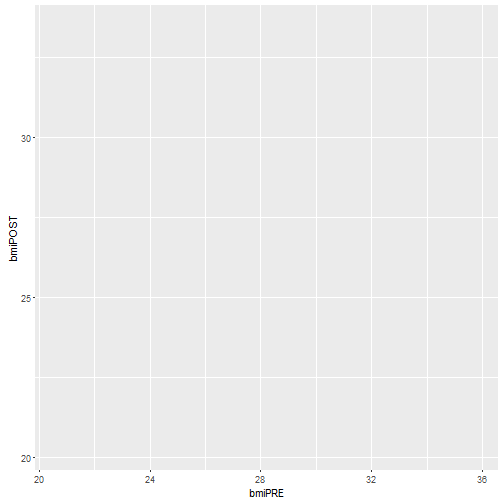
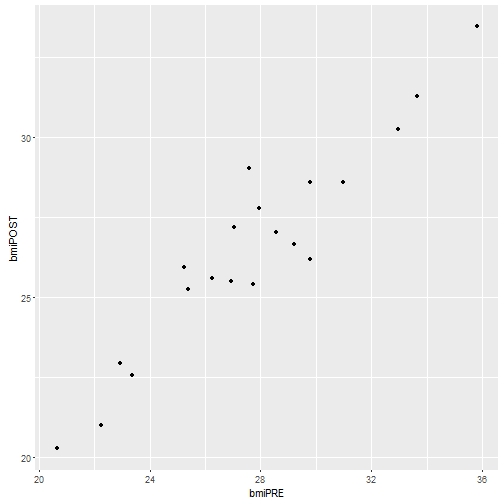
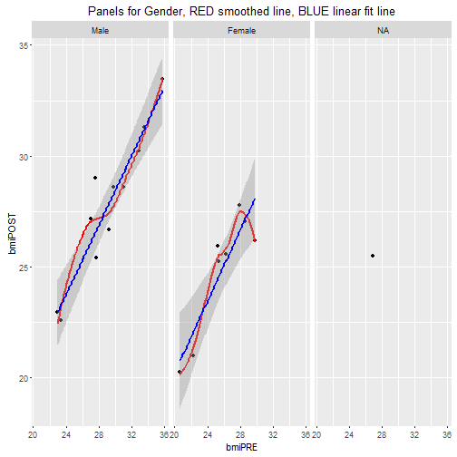
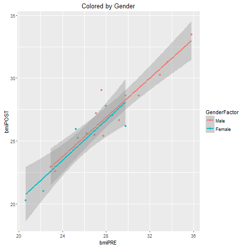

# Day1 Session 4
---

### Goals for Session 4

* a
* b
* c

---

### Let's revisit `ggplot2` 

Here is a quick plot of what we had previously using the base R graphics functions.


```r
plot(data.csv$bmiPRE, data.csv$bmiPOST, "p")
abline(lm(data.csv$bmiPOST ~ data.csv$bmiPRE), col="red")
lines(lowess(data.csv$bmiPRE, data.csv$bmiPOST), col="blue")
```


Let's recreate this plot using the `ggplot2` package and build up the `geom`s. We'll also add facets or panels by gender using the variable `GenderCoded` in the `data.csv` data frame. Notice that we used the `geom_smooth()` function to add a linear fit line by `method = "lm"`.


```r
p <- ggplot(data.csv, aes(bmiPRE, bmiPOST))
p
```



```r
p <- p + geom_point()
p
```



```r
p + geom_smooth(method="lm") + 
  facet_wrap(~GenderCoded) + 
  ggtitle("Panels for Gender")
```


It would be nice if we could add better labels for Gender instead of just the numeric codes. One way to do this is to create a new variable in the data frame that is a `FACTOR` that has the labels (or names) for each level of the Gender codes. We'll specify that the levels are 1 for "Male" and 2 for "Female". We can do this using the `factor()` command.


```r
data.csv$GenderFactor <- factor(data.csv$GenderCoded,
                                levels = c(1,2),
                                labels = c("Male","Female"))
```

Let's take a quick look at this new variable. We can simply list it. We can also use the `table()` function to summarize the frequencies (or counts) of the number of subjects for each gender.


```r
data.csv$GenderFactor
```

```
##  [1] Male   Female Female Male   Male   Female Male   Female <NA>   Male  
## [11] Male   Female Female Male   Male   Female Male   Male   Female Male  
## Levels: Male Female
```

```r
str(data.csv$GenderFactor)
```

```
##  Factor w/ 2 levels "Male","Female": 1 2 2 1 1 2 1 2 NA 1 ...
```

```r
class(data.csv$GenderFactor)
```

```
## [1] "factor"
```

```r
table(data.csv$GenderFactor)
```

```
## 
##   Male Female 
##     11      8
```

Using factors with `ggplot2` is really helpful for segmenting plots into panels or coloring points by this factor (i.e. gender in this case). Here is the code for separating the plot by gender. For now we will include the `NA`s or subjects who were missing gender from their record.


```r
p <- ggplot(data.csv, aes(bmiPRE, bmiPOST)) + 
  geom_point() + 
  geom_smooth(method = "loess", colour = "red", se = FALSE) + 
  geom_smooth(method = "lm", colour = "blue") + 
  facet_wrap(~GenderFactor) + 
  ggtitle("Panels for Gender, RED smoothed line, BLUE linear fit line")

p
```



This time let's just color the points by gender and then fit the lines separately by gender.


```r
p <- ggplot(data.csv, aes(bmiPRE, bmiPOST)) + 
  geom_point(aes(colour = GenderFactor)) + 
  geom_smooth(method = "lm", aes(colour = GenderFactor)) + 
  ggtitle("Colored by Gender")

p
```



## Take a closer look at the linear fit model


```r
fit1 <- lm(bmiPOST ~ bmiPRE, data=data.csv)
fit1
```

```
## 
## Call:
## lm(formula = bmiPOST ~ bmiPRE, data = data.csv)
## 
## Coefficients:
## (Intercept)       bmiPRE  
##      4.3245       0.8015
```

```r
summary(fit1)
```

```
## 
## Call:
## lm(formula = bmiPOST ~ bmiPRE, data = data.csv)
## 
## Residuals:
##     Min      1Q  Median      3Q     Max 
## -2.0235 -0.5695 -0.0740  0.4770  2.5987 
## 
## Coefficients:
##             Estimate Std. Error t value Pr(>|t|)    
## (Intercept)  4.32448    1.79047   2.415   0.0266 *  
## bmiPRE       0.80155    0.06403  12.517 2.55e-10 ***
## ---
## Signif. codes:  0 '***' 0.001 '**' 0.01 '*' 0.05 '.' 0.1 ' ' 1
## 
## Residual standard error: 1.084 on 18 degrees of freedom
## Multiple R-squared:  0.897,	Adjusted R-squared:  0.8912 
## F-statistic: 156.7 on 1 and 18 DF,  p-value: 2.55e-10
```

```r
coef(fit1)
```

```
## (Intercept)      bmiPRE 
##   4.3244779   0.8015493
```

```r
anova(fit1)
```

```
## Analysis of Variance Table
## 
## Response: bmiPOST
##           Df  Sum Sq Mean Sq F value   Pr(>F)    
## bmiPRE     1 184.005 184.005  156.69 2.55e-10 ***
## Residuals 18  21.138   1.174                     
## ---
## Signif. codes:  0 '***' 0.001 '**' 0.01 '*' 0.05 '.' 0.1 ' ' 1
```


