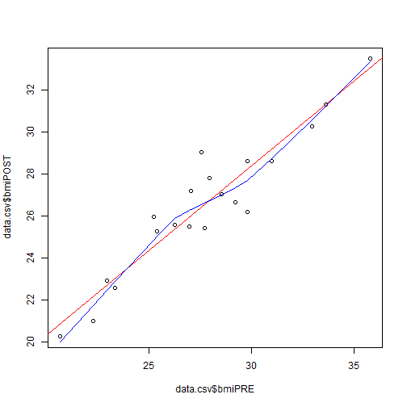

# Day 2 Session 1
---

### Session 4 - Writing a Report in RMarkdown

Using the codes we learned so far, let's compile these into a cohesive report.

1. Create an RMarkdown file - go to the menu "File"/"New File"/"RMarkdown". For now let's create a HTML formatted file (`*.HTML`). We'll run through this again at the end and also make a MS Word document (`*.DOC`).

2. This will create a template that we'll experiment with.

3. We'll be adding code chunks to perform certain actions and the output will be captured in our report.

4. Read in the dataset

```
data.csv <- read.csv(file="Dataset_01_comma.csv")
data.csv
```


| SubjectID| Age| WeightPRE| WeightPOST| Height| SES|GenderSTR | GenderCoded|
|---------:|---:|---------:|----------:|------:|---:|:---------|-----------:|
|         1|  45|       150|        145|    5.6|   2|m         |           1|
|         2|  50|       167|        166|    5.4|   2|f         |           2|
|         3|  35|       143|        135|    5.6|   2|F         |           2|
|         4|  44|       216|        201|    5.6|   2|m         |           1|
|         5|  32|       243|        223|    6.0|   2|m         |           1|
|         6|  48|       165|        145|    5.2|   2|f         |           2|
|         7|  50|       132|        132|    5.3|   2|m         |           1|
|         8|  51|       110|        108|    5.1|   3|f         |           2|
|         9|  46|       167|        158|    5.5|   2|          |          NA|
|        10|  35|       190|        200|    5.8|   1|Male      |           1|
|        11|  36|       230|        210|    6.2|   1|m         |           1|
|        12|  40|       200|        195|    6.1|   1|f         |           2|
|        13|  45|       180|        185|    5.9|   3|f         |           2|
|        14|  52|       240|        220|    6.5|   2|m         |           1|
|        15|  24|       250|        240|    6.4|   2|M         |           1|
|        16|  35|       175|        174|    5.8|   2|F         |           2|
|        17|  51|       220|        221|    6.3|   2|m         |           1|
|        18|  43|       230|        215|    2.6|   2|m         |           1|
|        19|  36|       190|        180|    5.7|   1|female    |           2|
|        20|  44|       260|        240|    6.4|   3|male      |           1|

5. Correct the typo for height, compute the BMIs and make the histogram plot

```
data.csv[18,"Height"] <- 5.6
data.csv$bmiPRE <- (data.csv$WeightPRE*703)/((data.csv$Height*12)**2)
data.csv$bmiPOST <- (data.csv$WeightPOST*703)/((data.csv$Height*12)**2)
hist(data.csv$bmiPRE, freq=FALSE)
lines(density(data.csv$bmiPRE))
```


6. Let's add our custom summary stats. We'll also save the output and use `kable()` from the knitr package to make a prettier table in markdown format.

```
mystats <- function(x, na.omit=FALSE){
  if(na.omit)
    x <- x[!is.na(x)]
  m <- mean(x)
  n <- length(x)
  s <- sd(x)
  md <- mad(x)
  q5 <- quantile(x, .05)
  q25 <- quantile(x, .25)
  q75 <- quantile(x, .75)
  q95 <- quantile(x, .95)
  return(c(n=n, mean=m, stdev=s, MAD=md, 
           q5, q25, 
           q75, q95))
}

out <- sapply(data.csv[,c(9,10)], mystats)
kable(out)
```


|      |    bmiPRE|   bmiPOST|
|:-----|---------:|---------:|
|n     | 20.000000| 20.000000|
|mean  | 27.703825| 26.530460|
|stdev |  3.882469|  3.285883|
|MAD   |  3.262064|  2.629625|
|5%    | 22.180669| 20.978775|
|25%   | 25.358466| 25.378441|
|75%   | 29.791735| 28.605143|
|95%   | 33.734610| 31.399496|


6. Let's also add the linear fits to a plot of the POST vs PRE BMI values

```
plot(data.csv$bmiPRE, data.csv$bmiPOST, "p")
abline(lm(data.csv$bmiPOST ~ data.csv$bmiPRE), col="red")
lines(lowess(data.csv$bmiPRE, data.csv$bmiPOST), col="blue")
```




7. Linear fit output

```
fit1 <- lm(bmiPOST ~ bmiPRE, data=data.csv)
fit1
summary(fit1)
coef(fit1)
anova(fit1)
```


```
## 
## Call:
## lm(formula = bmiPOST ~ bmiPRE, data = data.csv)
## 
## Coefficients:
## (Intercept)       bmiPRE  
##      4.3245       0.8015
```

```
## 
## Call:
## lm(formula = bmiPOST ~ bmiPRE, data = data.csv)
## 
## Residuals:
##     Min      1Q  Median      3Q     Max 
## -2.0235 -0.5695 -0.0740  0.4770  2.5987 
## 
## Coefficients:
##             Estimate Std. Error t value Pr(>|t|)    
## (Intercept)  4.32448    1.79047   2.415   0.0266 *  
## bmiPRE       0.80155    0.06403  12.517 2.55e-10 ***
## ---
## Signif. codes:  0 '***' 0.001 '**' 0.01 '*' 0.05 '.' 0.1 ' ' 1
## 
## Residual standard error: 1.084 on 18 degrees of freedom
## Multiple R-squared:  0.897,	Adjusted R-squared:  0.8912 
## F-statistic: 156.7 on 1 and 18 DF,  p-value: 2.55e-10
```

```
## (Intercept)      bmiPRE 
##   4.3244779   0.8015493
```

```
## Analysis of Variance Table
## 
## Response: bmiPOST
##           Df  Sum Sq Mean Sq F value   Pr(>F)    
## bmiPRE     1 184.005 184.005  156.69 2.55e-10 ***
## Residuals 18  21.138   1.174                     
## ---
## Signif. codes:  0 '***' 0.001 '**' 0.01 '*' 0.05 '.' 0.1 ' ' 1
```


